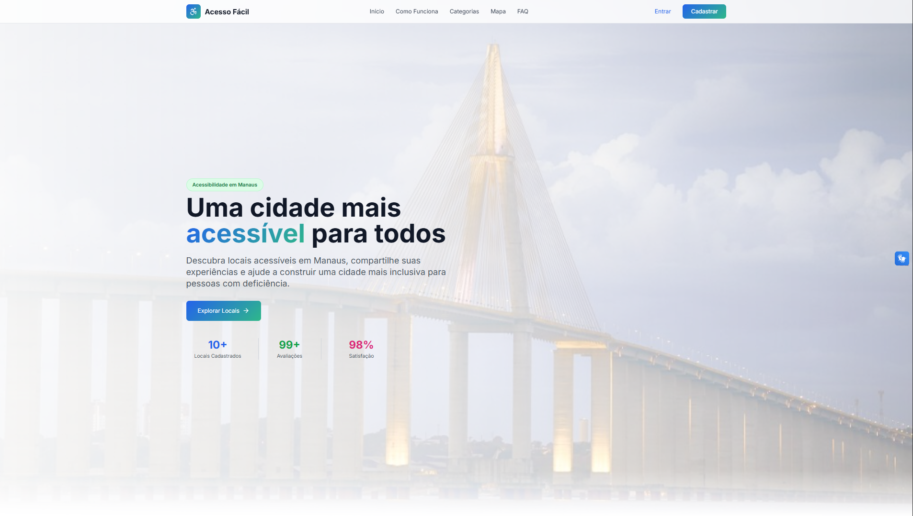

# 🌐 Acesso Fácil – Plataforma de Locais Acessíveis em Manaus

O **Acesso Fácil** é um sistema desenvolvido para promover acessibilidade urbana, permitindo que cidadãos descubram e avaliem locais acessíveis dentro da cidade de Manaus.  
A plataforma reúne informações sobre estabelecimentos, indicadores de acessibilidade, avaliações e comentários reais dos usuários.



O projeto inclui:
- **Interface Web moderna** com TailwindCSS  
- **Dashboard Analítica** com Highcharts  
- **Mapa Interativo** com Leaflet  
- **Sistema de Autenticação** (Laravel Breeze)  
- **Integração com VLibras**  
- **Modais interativos** com Sweet Alert 


---

## 🚀 Tecnologias Utilizadas

### **Backend**
- Laravel 
- Laravel Breeze (Autenticação)
- Eloquent ORM
- Seeders e Migrations

### **Banco de dados**

- MYSQL

### **Frontend**
- TailwindCSS 
- Highcharts.js
- Leaflet.js + MarkerCluster
-Sweet Alert (Modais JS)
- Sweet Icons
- Lucide Icons


### **Acessibilidade**
- VLibras (Inclusão de Libras)
- Layout responsivo e clean
- Ícones intuitivos

---

## 📦 Instalação e Configuração

### 1️⃣ Clone o repositório

```bash
https://github.com/ubir4net0/acesso-facil.git
cd acesso-facil
```

### 2️⃣ Instale as dependências PHP

```bash
composer install
```

### 3️⃣ Instale as dependências JS

```bash
npm install
```

### 4️⃣ Crie o arquivo `.env`

```bash
cp .env.example .env
```

### 5️⃣ Gere a chave da aplicação

```bash
php artisan key:generate
```

### 6️⃣ Configure o banco de dados no `.env`

```
DB_DATABASE=acessofacil
DB_USERNAME=root
DB_PASSWORD=secret
```

### 7️⃣ Rode as migrations

```bash
php artisan migrate
```

### 8️⃣ Popule o banco com dados iniciais (categorias, locais, usuários etc.)

```bash
php artisan db:seed
```

ou, se quiser rodar tudo:

```bash
php artisan migrate:fresh --seed
```

### 9️⃣ Inicie o servidor Laravel

```bash
php artisan serve
```

### 🔟 Inicie o Vite

```bash
npm run dev
```

---

## 🌍 Funcionalidades Principais

### 🗺️ **Mapa Interativo**
- Ícones personalizados (Sweet Icons)
- Filtros por categoria
- Localização do usuário em tempo real
- Exibição de detalhes do local
- Marcação manual de pontos acessíveis

### ⭐ **Avaliações & Comentários**
- Usuários podem avaliar locais
- Sistema de 1 a 5 estrelas

### 📊 **Dashboard Analítica**
- Avaliações mais altas
- Locais mais comentados
- Total de avaliações por categoria
- Gráficos modernos com Highcharts


### 🎨 **UI Moderna**
- TailwindCSS
- Design consistente
- Responsivo

## 👤 Autor

Projeto desenvolvido por **Ubirajara Neto** para a apresentação do InovaTech 2025, evento promovido pela universidade FAMETRO

 


